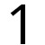
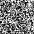
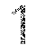
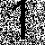
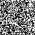

# ofs-generator
Optical flow stenography generator

# How to use it

Install the Python dependency:

```
python -m pip install -r requirements.txt
```

Then run the generator with an image path:

```
python generator.py secret.png
```
Image "secret.png" must be a Black & White image (mask). Secret is black, background is white. Can be a normal RGB image in wathever format but only with two colors (no grays).

# How works
## 1. Input secret
- Load the user **secret image**: "secret.png"  

- Converts to open cv mask image: **secret mask image**  

## 2. Main image
- Creates **random noise image** with the same dimensions as **secret image**  

- Extract ALL elements inside the **secret mask image**. Background is alpha channel  

## 3. Conscutive images
- Clones the original **random noise image**  

- Clone the **secret mask image** and move it upwards a little bit  
  
- Remove all pixels from the cloned **random noise image**  

- Fill that empty space with a translated version of **secret mask image** to have the final image  


## Final
We have 2 images (can be wathever number of images):  
 

Now we can make a gif with both and reveal the secret:  
